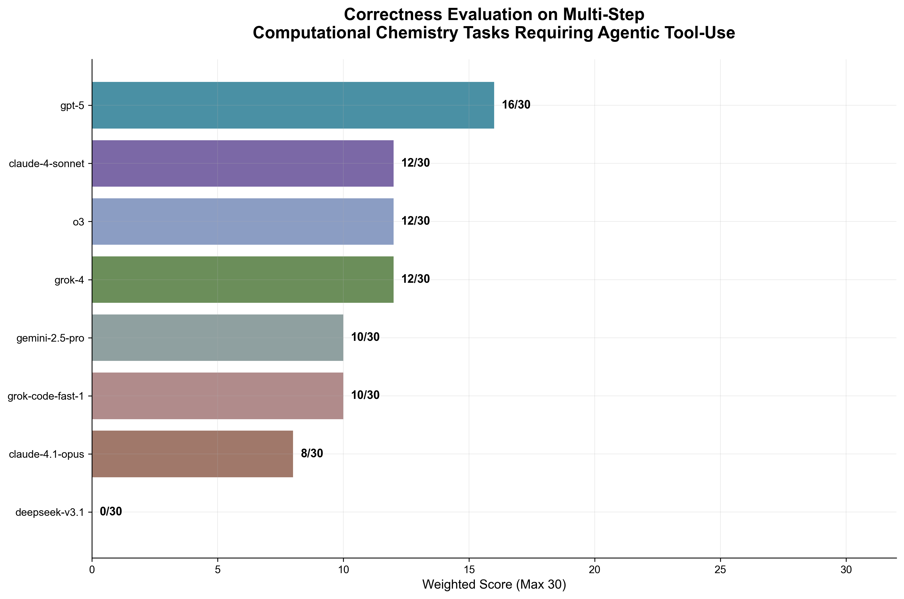
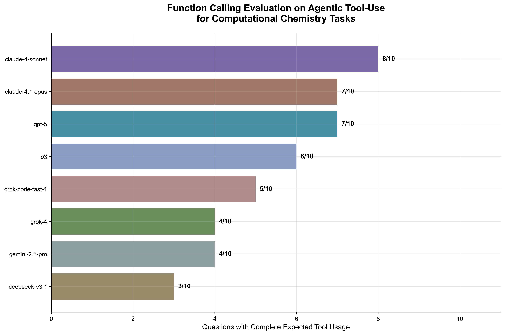

# LabAgents

Large Language Model (LLM) agents are increasingly capable of using external tools via MCP to perform complex tasks. However, existing benchmarks rarely focus on life sciences research contexts or simulate tool-rich experimental environments. 

**LabAgents** addresses this gap as a domain-specific benchmark for chemistry and biology research workflows, evaluating how well AI agents leverage MCP (Model Context Protocol) tools. It measures an agent's ability to:

1. **Select the right tools** from a chemistry/biology MCP suite
2. **Plan and execute multi-step** experimental workflows  
3. **Deliver correct results** on scientific tasks

> *TL;DR: It tests how well agents can navigate through problems, just as a scientist would.*

---

## Models Evaluated

| Model | Provider | Type |
|-------|----------|------|
| **claude-4.1-opus** | Anthropic | Latest Opus model |
| **claude-4-sonnet** | Anthropic | Latest Sonnet model |
| **gpt-5** | OpenAI | Latest flagship model |
| **o3** | OpenAI | Reasoning model |
| **grok-4** | xAI | Latest model |
| **gemini-2.5-pro** | Google | Latest Gemini model |
| **deepseek-v3.1** | DeepSeek | Latest model |
| **grok-code-fast-1** | xAI | Fast coding model |

## Rowan MCP Tools

### Core Calculations
- `rowan_multistage_opt` - Multi-level geometry optimization with hierarchical methods
- `rowan_conformers` - Conformer generation and optimization  
- `rowan_electronic_properties` - Electronic structure properties (orbitals, density, ESP)
- `rowan_spin_states` - Spin state calculations for different multiplicities
- `rowan_molecular_dynamics` - MD simulations with various ensembles

### Chemical Properties
- `rowan_pka` - pKa value predictions
- `rowan_redox_potential` - Oxidation/reduction potentials vs SCE
- `rowan_solubility` - Solubility predictions in multiple solvents
- `rowan_tautomers` - Tautomer enumeration and ranking
- `rowan_fukui` - Fukui indices for reactivity prediction

### Drug Discovery  
- `rowan_admet` - ADME-Tox property predictions
- `rowan_descriptors` - Molecular descriptors for ML/QSAR
- `rowan_docking` - Protein-ligand docking with ML refinement

### Reaction Analysis
- `rowan_scan` - Potential energy surface scans (1D/2D)
- `rowan_scan_analyzer` - Extract key geometries from scans
- `rowan_irc` - Intrinsic reaction coordinate calculations

### Utilities
- `rowan_molecule_lookup` - PubChem lookup with caching
- `rowan_workflow_management` - Manage computational workflows
- `rowan_folder_management` - Organize calculations in folders
- `rowan_system_management` - Server utilities and information

## Benchmark Structure

### Tier 1: Basic Tool Selection
Simple, direct questions requiring selection of a single appropriate tool.

### Tier 2: Multi-Tool Orchestration  
Tasks requiring workflow planning and independent calculations across multiple tools.

### Tier 3: Scientific Planning and Conditional Logic
Complex tasks where outputs from one workflow become inputs of another.

### Example Questions

| Tier | Question |
|------|----------|
| **1** | "Calculate the ADMET properties of semaglutide to assess its pharmacokinetic profile." |
| **2** | "Generate conformers of semaglutide and identify the lowest energy structure, then calculate its solubility in water at physiological pH." |
| **3** | "Analyze the binding of semaglutide to the GLP-1 receptor, optimize the docked pose, then compare how modifications to the fatty acid chain length affect both binding affinity and predicted half-life." |

## Benchmark Questions

**10 multi-step computational chemistry tasks** spanning drug discovery, pharmacology, and molecular analysis.

**[→ See All Questions](questions/v2_queries.md)** 

---

## Results

8 commonly used foundational models were tested on computational chemistry tasks requiring agentic tool-use with weighted scoring (Tier 2 = 2pts, Tier 3 = 4pts, max 30pts).

### Correctness Evaluation

*Correctness assessment: GPT-5 leads, followed by Claude 4 Sonnet and o3. Evaluation via LLM-as-a-judge*

### Tool Selection Assessment
  
*Complete tool usage assessment: Claude 4 Sonnet leads, calling all expected tools for 8/10 tasks.*

### Top Performers
- **GPT-5**: Highest correctness score (16/30 weighted)
- **Claude 4 Sonnet**: Best tool selection (8/10 complete)

**[→ The full 'There and Back Again'](REFLECTIONS.md)**

---

## Future Directions

> *This is... very far from complete.*

My first time evaluating agentic tool-use revealed how **nuanced** this area is - evaluations exist at the intersection of art and science. While chemistry has objective answers, selecting meaningful metrics requires domain intuition.

### What's Next

**Better scoring methods**  
I still need to noodle on this - even madness needs its method. Difficulty assessment was based off "vibes" rather than empirical validation, which is lousy for reproducibility.

**Data collection gaps**  
Hindsight is 20/20. Future work needs consistent logging of:
- Parameter extraction
- Function call results  
- Intermediate responses
- Time tracking

Current logging was inconsistent and missed important interactions.

**Eval-as-you-go**  
Can real-time assessment catch edge cases as they emerge? Can new problems be generated dynamically in response to model performance?

**Community engagement**  
An LMArena-style platform for biology/chemistry AI where researchers submit challenging problems and see head-to-head comparisons could create a dynamic benchmark that evolves with the field's needs.

**Model shortcuts**  
Some models gave correct answers without calling expected tools (Claude 4.1 Opus predicted pKa accurately without using the pKa tool). There's also an untouched layer - do agents choose scientifically sound computational methods?
