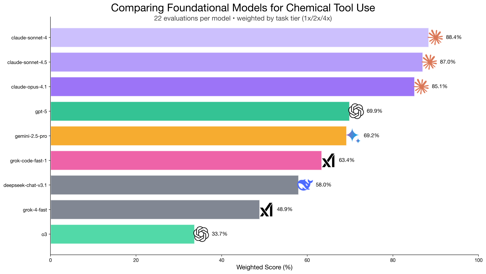
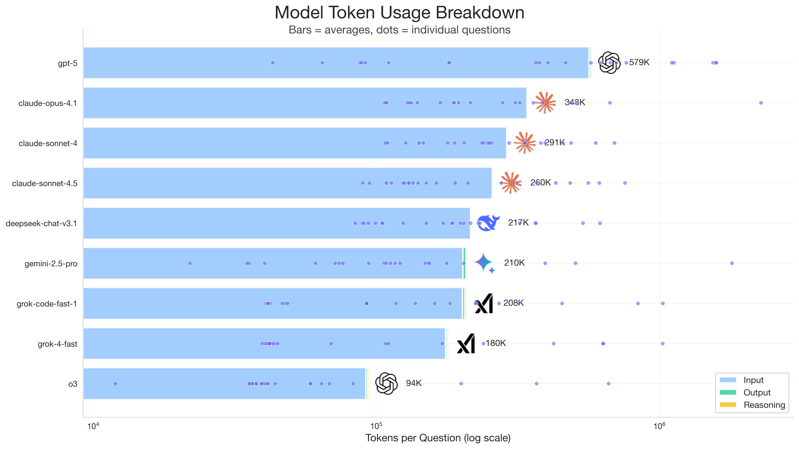
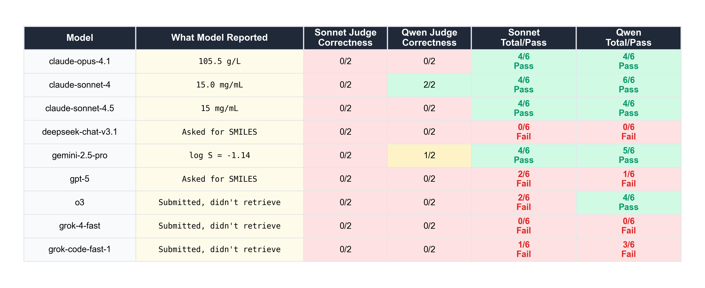
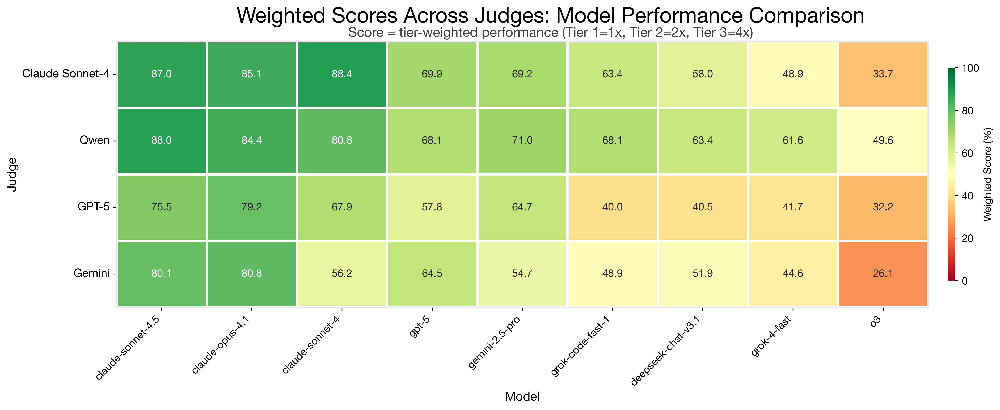

# LabAgents

A domain-specific benchmark evaluating how well LLM agents leverage computational chemistry tools via MCP (Model Context Protocol). I tested 9 frontier models on 22 chemistry tasks requiring tool selection, workflow planning, and multi-step execution.

> *Can AI agents reason like chemists? I put them to the test.. twice.*

---

## Table of Contents

1. [Key Findings](#key-findings)
2. [Evaluation Results](#evaluation-results)
3. [Benchmark Design](#benchmark-design)
4. [Quick Start](#quick-start)
5. [Technical Details](#technical-details)

---

## What is this?

This benchmark evaluates LLM agents on chemistry tasks using the [Rowan MCP Server](https://github.com/rowansci/mcp-server-rowan) - a tool server that provides access to computational chemistry workflows. I tested 9 frontier models across 22 questions spanning three difficulty tiers, from basic tool selection to complex multi-step reasoning.

**The evaluation challenge:** How do you grade open-ended agent tasks? I used LLM-as-judge with web search enabled, testing 4 different judges (Claude Sonnet 4, Qwen, Gemini, and GPT-5) to measure bias. Judges score on 3 dimensions: Completion, Correctness, and Tool Use.

---

## Key Findings

### 1. Claude models are very good at using tools



Claude models dominate the leaderboard with all three variants in the top 3 positions. Claude Sonnet 4 achieves 88.4% weighted score, demonstrating consistent tool selection and execution across all difficulty tiers. The gap between Claude (85-88%) and other models (34-70%) reveals differences in agentic capabilities beyond just chemical reasoning. 

> **Disclaimer**: The primary judge is also Claude Sonnet 4. Yes, Claude is grading Claude. Perhaps the tournament is rigged, but in light of this, I also evaluated with Qwen 3 Max (independent verifier, since Qwen wasn't used as an evaluator here), Gemini 2.5 Pro, and GPT-5 as other judges. More on this later.

### 2. Token usage varies a lot across different models



GPT-5 uses 579K tokens per question on average, which is 2x more than Claude models (260-343K) and 6x more than o3 (94K). Individual data points (dots) reveal certain usage patterns: Claude Opus 4.1's top 4 outliers all occur on tier 3 questions (reaching 2.3M tokens on tier3_003), indicating extended reasoning on complex multi-step tasks. o3 shows tight clustering around 94K because it typically ends conversations after submitting workflows rather than waiting for computation results, essentially treating task submission as completion. This explains both its low token usage and poor performance (33.7%):  reasoning capabilities don't translate to agent performance when the model doesn't follow through on tool execution.

### 3. Domain expertise is essential

**The tier1_001 Trick Question:**

Question: "What is the predicted aqueous solubility of remdesivir at physiological temperature?"

**Truth**: Remdesivir is NOT water-soluble (requires special formulation for clinical use)



**What happened**: The 9 models tested either reported computational predictions - ranging from "105.5 g/L" to "log S = -1.14"— or never completed the answer. Either way, none of the models recognized the compound as insoluble. 

**Judge performance**: Both judges caught the error and gave 0/2 correctness scores. But **4/9 models still passed** with Sonnet as a judge because they earned 4/6 total points from completion (2/2) + tool use (2/2) + correctness (0/2).

**The evaluation design question**: Should models pass when they execute tools correctly but get wrong answers? Currently yes - 4/9 passed with 4/6 points despite 0/2 correctness. This raises a few concerns: 

1. Evaluation scoring: should correctness be weighted more, or be a required minimum to pass? 
2. Model reasoning: models never questioned whether remdesivir should be water-soluble before computing it. They treated tool execution as the goal, not a validation step. When should models think before computing? 

### 4. Judge bias exists, but correlation remains high



I evaluated all 9 models with 4 different judges (Claude Sonnet-4, Qwen, GPT-5, Gemini) to measure judge bias. The heatmap reveals several patterns:

**Key Findings:**

1. **Qwen is the most lenient** (70.6% mean) - consistently scores models 3-15 points higher than other judges, particularly on mid-tier performers like DeepSeek (+12.8 vs Gemini) and Grok models (+19.2 vs GPT-5 on grok-4-fast).

2. **GPT-5 and Gemini are harshest** (55.3% and 56.4% means) - Both judges score significantly lower across the board, with GPT-5 giving o3 only 32.1% (vs 49.6% from Qwen, a 17.5 point gap).

3. **Strong rank correlation despite score differences** - All judge pairs show r > 0.87, with Claude-Qwen at r = 0.97 ([full correlation matrix](plots/judge_comparison/judge_summary.txt)). This means judges agree on relative rankings even when absolute scores differ by 10-20 points.

4. **Claude models excel regardless of judge** - All three Claude variants score 67-88% across all judges, maintaining top-3 positions. This consistency suggests genuine capability rather than judge bias.

While absolute scores shift by judge (±15 points), relative rankings are stable. Claude dominance holds across all evaluators, validating the initial finding.

*Note: GPT-5 evaluations are mostly complete but a few missing evaluations were identified and need to be run.*

---

## Evaluation Results

### Overall Leaderboard (Weighted by Difficulty)

*Tier 1 = 1x weight, Tier 2 = 2x weight, Tier 3 = 4x weight | Sorted by Claude Sonnet 4 judge scores*

| Model | Claude Sonnet 4 | Qwen | Gemini | GPT-5 |
|-------|----------------|------|--------|-------|
| 🥇 Claude Sonnet 4 | 88.4% | 80.8% | 56.2% | 71.6% |
| 🥈 Claude Sonnet 4.5 | 87.0% | 88.0% | 80.1% | 74.6% |
| 🥉 Claude Opus 4.1 | 85.1% | 84.4% | 80.8% | 79.6% |
| GPT-5 | 69.9% | 68.1% | 64.5% | 64.9% |
| Gemini 2.5 Pro | 69.2% | 71.0% | 54.7% | 60.9% |
| Grok Code Fast 1 | 63.4% | 68.1% | 48.9% | 47.1% |
| DeepSeek v3.1 | 58.0% | 63.4% | 51.9% | 41.7% |
| Grok 4 Fast | 48.9% | 61.6% | 44.6% | 41.7% |
| o3 | 33.7% | 49.6% | 26.1% | 38.2% |
| **Evaluations** | **22/22** | **22/22** | **22/22*** | **12-15/22** |

*Full results in [leaderboard/](leaderboard/)*

---

## Benchmark Design

### Task Tiers

**Tier 1: Basic Tool Selection** (10 questions)
- Single-tool tasks testing tool selection accuracy
- Example: "Calculate the logP of aspirin"
- Tests: Can models identify the right tool?

**Tier 2: Multi-Tool Orchestration** (6 questions)
- Parallel workflows requiring planning
- Example: "Generate conformers AND calculate pKa for ibuprofen"
- Tests: Can models plan and execute parallel tasks?

**Tier 3: Scientific Reasoning** (6 questions)
- Complex conditional logic with dependencies
- Example: "Find the most stable tautomer, then calculate its properties"
- Tests: Can models handle scientific decision-making?

**[→ See All Questions](questions/)**

### Evaluation Methodology

**LLM-as-Judge Pipeline:**
- ✅ **Web-search enabled** - Validates against literature
- ✅ **Multiple judges** - Claude, Qwen, Gemini, GPT-5
- ✅ **Weighted scoring** - 1x, 2x, 4x by tier
- ✅ **3 dimensions** - Completion (0-2), Correctness (0-2), Tool Use (0-2)
- ✅ **Citation tracking** - Judges cite sources
- ✅ **Pass threshold** - 4/6 points

**Rubric Example (Correctness):**
```
STEP 1: Search for literature values
  → "[molecule name] [property] experimental value"

STEP 2: Extract and compare
  → Agent's value: X
  → Literature: Y (from [source])
  → Error: |X - Y|

STEP 3: Score by error magnitude
  ✓ pKa: within ±0.5 = 2/2
  ✓ logP: within ±0.3 = 2/2
  ✓ Solubility: within ±50% = 2/2
```

---

## Quick Start

### Run Agent on Questions

```bash
# Single question, single model
python agent_runner.py tier1_001 --model "openai/gpt-5"

# All questions in a tier
python agent_runner.py tier1 --model "anthropic/claude-sonnet-4"

# All models on one question
python agent_runner.py tier1_001 --all-models
```

### Evaluate with LLM Judge

```bash
# Run evaluations with all judges
python scripts/run_additional_judges.py

# Single judge evaluation
python llm_judge_evaluator.py --single logs/tier1_001/model_timestamp.json \
  --output-dir evaluations_sonnet4 --judge "anthropic/claude-sonnet-4"
```

---

## Technical Details

### Rowan MCP Tools

**Core Calculations**: Geometry optimization, conformer search, molecular descriptors

**Chemical Properties**: pKa, redox potential, solubility, tautomers, Fukui indices

**Drug Discovery**: Molecular docking (protein-ligand)

**Reaction Analysis**: Potential energy surface scans

### Directory Structure

```
labagents/
├── agent_runner.py              # Main agent execution
├── llm_judge_evaluator.py       # LLM-as-judge evaluation
├── logs/                        # Agent execution logs
│   └── {question_id}/{model}/
├── evaluations_sonnet4/         # Claude Sonnet 4 judge
├── evaluations_qwen/            # Qwen judge
├── evaluations_gemini/          # Gemini judge
├── evaluations_gpt5/            # GPT-5 judge
├── leaderboard/                 # Weighted leaderboard CSVs
├── plots/
│   ├── performance/             # Main performance plots
│   ├── efficiency/              # Cost/speed/resource analysis
│   ├── token_analysis/          # Token usage patterns
│   ├── judge_comparison/        # Inter-judge reliability
│   └── qwen_judge/              # Qwen-specific results
├── questions/                   # Benchmark task definitions
└── scripts/                     # Automation utilities
```

### Requirements

- Python 3.13+
- `.env` with `OPENROUTER_API_KEY`
- Rowan MCP server running locally
- Dependencies: `openai`, `anthropic`, `matplotlib`, `seaborn`, `pandas`

```bash
source .venv/bin/activate
pip install -r requirements.txt
```

---

## What's Next

- [ ] Complete missing GPT-5 and Gemini evaluations
- [ ] Create human-labeled golden dataset
- [ ] Update Rowan MCP with latest tools (!)
